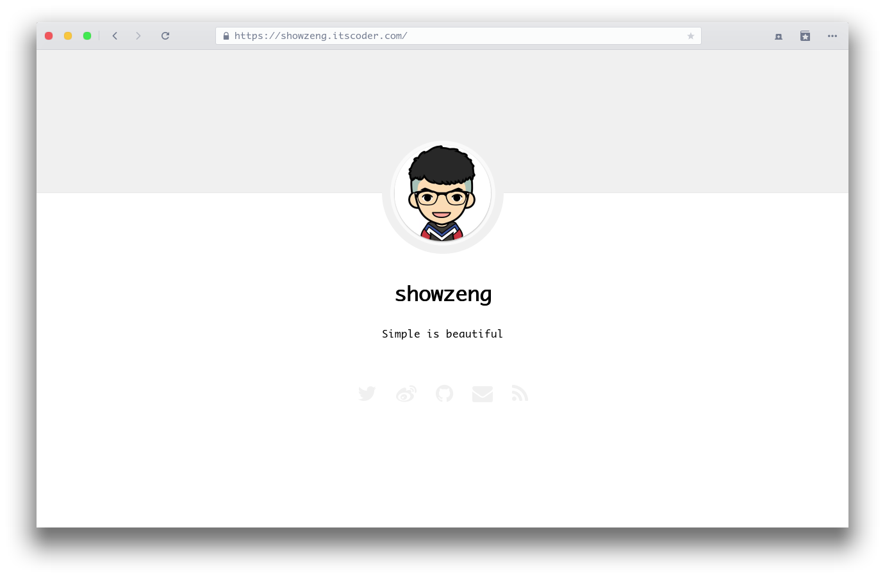

# Minimalism

[](https://travis-ci.org/showzeng/Minimalism)
[](https://jekyllrb.com/)
[](https://badge.fury.io/rb/jekyll-theme-minimalism)
[](./LICENSE.txt)



Minimalism 是一款基于 Jekyll 为极简主义者打造的极简主题。你可以访问 [我的博客][blog] 或者 [主题 demo][demo] 来预览一下。

## 特性

**V0.1.x**
- 这款主题采用响应式布局，对各大主流浏览器做了兼容，对移动客户端做了适配
- 支持 RSS 订阅
- SEO 优化
- 文章默认采用 [CC BY-NC-ND 4.0][license] 协议对著作权进行保护，支持 emoji 表情
- 支持禁止复制、禁止右键菜单、复制附带版权声明等多种功能
- 支持文章图片查看大图
- 支持文章打赏 (微信、支付宝)
- 支持评论功能 (目前支持来必力、gitment)
- 支持站点统计 (目前支持谷歌统计、百度统计、友盟 cnzz 统计)
- 最后且最重要的当然还是对博客文章极度的阅读体验优化

## 安装

在你的 `Gemfile` 文件中加入下面这一行:

```ruby
gem "jekyll-theme-minimalism"
```

然后使用 bundle 执行安装:

    $ bundle install

或者你也可以手动下载安装:

    $ gem install jekyll-theme-minimalism

在你的配置文件 `_config.yml` 中修改启用主题 (本地预览):

```yaml
theme: jekyll-theme-minimalism
```

使用 GitHub pages 发布时，在你的配置文件 `_config.yml` 中修改启用远程主题:

```yaml
# theme: jekyll-theme-minimalism
remote_theme: showzeng/Minimalism
```

## 使用

移步 [wiki] 或者查看 [demo]。

## 支持

如果你觉得这个主题还不错，欢迎 star 或使用。你也可以自由的 fork，基于本主题打造你自己的主题，当然，希望最好是能署名或提及本博客主题。

此外你有什么好的建议、需求或者是碰到什么问题，欢迎提交 [issue]，本主题还会不断完善。

## 致谢

博客主题文章的文字颜色及部分排版受凯哥 [HenCoder] 网站的启发，打赏样式受 [写代码的猴子的博客][Jaeger] 的启发，特此感谢。

文章图片查看大图由 [zooming](https://github.com/kingdido999/zooming) 提供支持，特此感谢。

## Todo

- [ ] Multilingual support (多语言支持)
- [ ] Toc (文章索引目录)
- [ ] Math support with LaTeX (数学公式支持)

## Change log

查看 [版本更新日志][Change Log]

## 打赏

如果主题对你有帮助，并帮你节省了一些折腾的时间，可以考虑打赏，这是对我所做工作的最大肯定。


## License

The theme is available as open source under the terms of the [MIT License](https://opensource.org/licenses/MIT).

[blog]: https://showzeng.itscoder.com
[demo]: https://showzeng.github.io
[license]: https://creativecommons.org/licenses/by-nc-nd/4.0/
[wiki]: https://github.com/showzeng/Minimalism/wiki
[issue]: https://github.com/showzeng/Minimalism/issues/new
[Change Log]: https://github.com/showzeng/Minimalism/wiki/Change-Log
[HenCoder]: https://hencoder.com/
[Jaeger]: https://jaeger.itscoder.com/
